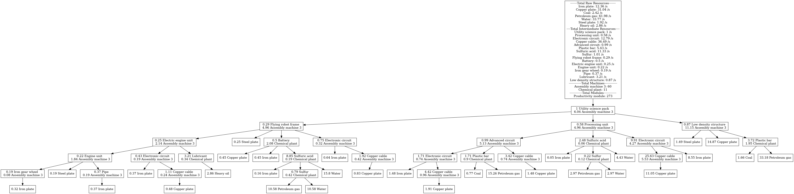

# Factorio Production Tree Visualizer

A Python tool that calculates and visualizes complete production dependency trees for Factorio items. Given a target item and desired production rate, it computes all required resources, intermediate products, and machines needed.



## Features

- **Recursive dependency calculation** - Automatically resolves the full production chain for any craftable item
- **Machine & module support** - Accounts for different machine types (assemblers, furnaces, chemical plants) and module bonuses (speed, productivity)
- **Main bus awareness** - Treats common items (iron plates, copper plates, etc.) as available resources
- **Multiple output formats**:
  - Terminal ASCII tree
  - PNG image
  - GraphViz DOT file
  - Draw.io XML (editable diagrams)

## Requirements

- Python 3.x
- [uv](https://docs.astral.sh/uv/) (Python package manager)
- [Graphviz](https://graphviz.org/download/) (system package)

### Installation

Install Graphviz and its development headers:

```bash
sudo apt-get install graphviz graphviz-dev
```

Install Python dependencies:

```bash
uv venv
source .venv/bin/activate
uv pip install treelib InquirerPy pydot graphviz2drawio
```

## Usage

Run the script:
```bash
./run.sh
```

You'll be prompted to:
1. **Select an item** - Fuzzy-searchable list of all craftable items
2. **Enter quantity** - Desired production rate (items per second)
3. **Choose a module** - Speed, productivity, or efficiency modules
4. **Choose an assembler** - Assembly machine 1, 2, or 3
5. **Choose a furnace** - Stone, steel, or electric furnace

Output files are saved to `output/<item>_x<quantity>/` containing:
- `.dot` - GraphViz source file
- `.png` - Rendered tree image
- `.xml` - Draw.io editable diagram

## Configuration Files

### `recipes.json`
Contains item recipes with crafting times, ingredients, output amounts, and compatible machines. Each recipe has:
- `type`: `base_material`, `intermediate_product`, or `final_product`
- `machine_type`: List of machines that can craft this item
- `crafting_time`: Time in seconds
- `output_amount`: Items produced per craft
- `ingredients`: Required materials and quantities

### `machines.json`
Defines machine properties:
- `type`: `assembler`, `furnace`, or `chemical_plant`
- `crafting_speed`: Speed multiplier
- `module_slots`: Number of module slots

### `modules.json`
Module bonuses for speed, productivity, and efficiency.

### `main_bus.json`
Items treated as "always available" from your main bus. These appear as leaf nodes in the tree rather than being expanded further.

## Customization

The recipe database covers common items but may not include everything. To add missing items, edit `recipes.json` following the existing format:

```json
"Item name": {
    "type": "intermediate_product",
    "machine_type": ["Assembly machine 1", "Assembly machine 2", "Assembly machine 3"],
    "crafting_time": 0.5,
    "output_amount": 1,
    "stack_size": 100,
    "ingredients": {
        "Iron plate": 1,
        "Copper plate": 2
    }
}
```

## Notes

- Productivity modules only apply to intermediate products, not final products (matching game mechanics)
- Machine counts are rounded up for the totals but shown as decimals in the tree for precision
- Chemical plant is automatically selected for recipes that require it
